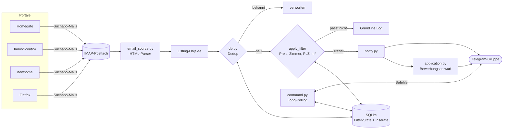

# Wohnungs-Bot Zürich

[](https://github.com/claudiokoller/wohnungs-bot/actions/workflows/ci.yml)
[](LICENSE)

Ein Telegram-Bot, der Mietinserate aus vier Schweizer Immobilienportalen in
einen gemeinsamen Chat bündelt: filtert nach eigenen Kriterien, entfernt
Duplikate über Portalgrenzen hinweg und schreibt zu jedem Treffer einen
fertigen Bewerbungsentwurf.

Gebaut für eine 2er-WG-Suche in der Region Zürich und dort von Mai bis
September 2026 durchgehend produktiv gelaufen — auf einem eigenen VPS, mit
automatischem Deployment. Danach pausiert: Wohnung gefunden.

> Python 3.10+ · SQLite · IMAP · Telegram Bot API · systemd · GitHub Actions
> · keine Frameworks · ~4'800 Zeilen · 60 Unit-Tests

<!-- Screenshot: Datei als docs/bilder/telegram-feed.png ablegen und die
     folgende Zeile einkommentieren. Vorher Gruppennamen, Mitgliederliste und
     eigene Nachrichten wegschneiden.


-->

---

## Das Problem

Wer in Zürich eine Wohnung sucht, hat Suchabos bei Homegate, ImmoScout24,
newhome und Flatfox — und damit vier Mailfluten, in denen dieselben Inserate
mehrfach auftauchen, viele gar nicht zu den eigenen Kriterien passen und die
interessanten untergehen. Zu zweit suchen heisst zusätzlich: beide müssen
denselben Stand haben.

Der Bot dreht das um. Ein Kanal, ein Feed, keine Duplikate, Filter jederzeit
per Chat-Befehl änderbar.

## Architektur



**Details zur Architektur, den Datenflüssen und den technischen Entscheiden:
[docs/architektur.md](docs/architektur.md)**

## Technische Entscheide

**Suchabo-Mails statt Scraping.** Die Portale sind hinter Cloudflare und
verbieten Scraping in den AGB. Ihre eigenen Suchabo-Mails liefern dieselben
Treffer freiwillig und legal — und die Portale filtern schon vor. Kein
Bot-Schutz zu umgehen, keine Scraper-Wartung bei jedem Redesign.

**Dedup über Portalgrenzen.** Dasselbe Inserat kommt oft von drei Portalen.
Der Bot löst die Tracking-Redirects auf, um an die echte Listing-ID zu
kommen (stabiler Schlüssel), und fällt auf einen Inhalts-Fingerprint
zurück, wenn das nicht klappt.

**Die Datenbank führt, nicht die Config.** Filter sind zur Laufzeit per
Telegram änderbar (`/preis 2400`). `config.SEARCH` seedet nur den ersten
Start, danach ist die SQLite-Tabelle die einzige Wahrheit — sonst driften
zwei Filterstände auseinander.

**Bewerbungsentwurf ohne LLM.** Ein deterministisches Template aus dem
Bewerberprofil. Verlässlich, kostenlos, keine Halluzination in einem Text,
der an einen Vermieter geht. Verschickt wird nichts automatisch: die
Empfängeradresse steht fast nie im Inserat, der Kontakt läuft übers
Portalformular. Der Bot liefert den fertigen Text, absenden macht der Mensch.

**Verworfene Inserate hinterlassen eine Spur.** Wenn nichts durchkommt, sieht
"Filter zu eng", "Suchabo zu breit" und "Parser gebrochen" im Log sonst
identisch aus. Deshalb protokolliert der Bot zu jedem verworfenen Inserat den
Grund und die Verteilung: `5 von 6 verworfen (2× PLZ, 1× Fläche, 1× Preis)`.

## Telegram-Befehle

| Bereich | Befehle |
|---|---|
| Filter | `/preis` · `/zimmer` · `/plz` (mit Gemeindenamen statt PLZ) · `/exclude` · `/pause` · `/resume` |
| Inserate | `/liste` · `/delete` · `/now` |
| Status | `/status` (Filter) · `/stats` (Zahlen) · `/portale` (Quellen) · `/help` |
| Betrieb | `/health` (Zustand pro Portal) · `/backup` (DB-Backup) |

Jedes Inserat kommt mit Inline-Buttons: ⭐ Merken und 📝 Entwurf. Um 20:00
Zürich-Zeit fasst der Bot die gemerkten Inserate des Tages zusammen.

## Betrieb: was schiefging

Der interessanteste Teil des Projekts war nicht das Bauen, sondern die vier
Monate danach. Drei Ausfälle, jeder still — der Bot lief fehlerfrei weiter
und schickte einfach nichts mehr:

| Ausfall | Ursache | Konsequenz im Code |
|---|---|---|
| Feed 9 Tage leer | Postfach-Quota voll, Provider wies eingehende Mails ab | Verarbeitete Mails werden gelöscht statt nur als gelesen markiert |
| Feed 2 Wochen leer | Mailkonto gesperrt, IMAP-Login abgelehnt | Eskalation bei Fehler-Streaks statt endlosem Retry als "transient" |
| Feed leer trotz Mails | Suchabos breiter gefasst als der Bot-Filter | Verwerfungsgrund pro Inserat im Log |

Die Lehre: Ein Bot, der Nachrichten weiterleitet, meldet seinen eigenen
Ausfall nicht — Stille sieht aus wie "nichts Passendes dabei". Deshalb
überwacht er inzwischen den Maileingang pro Portal und meldet sich selbst,
wenn eine Quelle verstummt.

## Setup

```bash
git clone https://github.com/claudiokoller/wohnungs-bot.git
cd wohnungs-bot
pip install -r requirements.txt

cp .env.example .env        # Bot-Token, IMAP-Zugang, DB-Pfad eintragen
# Suchkriterien und Bewerberprofil in config.py anpassen

python main.py --seed       # Altinserate als gesehen markieren, nichts senden
python main.py --loop       # Dauerbetrieb, Poll alle 15 Minuten
python command.py           # Telegram-Befehle (zweiter Prozess)
```

Ausführliche Schritt-für-Schritt-Anleitung inklusive Telegram-Gruppe, IMAP
und systemd: [SETUP.md](SETUP.md).

```bash
python test_command.py      # 60 Tests, ohne pytest lauffähig
```

## Module

| Datei | Aufgabe |
|---|---|
| `main.py` | Orchestrierung: `--seed`, `--loop`, `--dump-emails` |
| `email_source.py` | IMAP-Quelle: Alert-Mails → `Listing` |
| `sources.py` | `Listing`-Datentyp + Telegram-Formatierung |
| `db.py` | SQLite: Dedup, Filter-State, Merkliste, Mail-Log |
| `command.py` | Telegram Long-Polling, alle Befehle, Tagesübersicht |
| `notify.py` | Telegram-Versand mit Inline-Buttons |
| `application.py` | Bewerbungsvorlage |
| `plz_lookup.py` | PLZ ↔ Gemeindename, 162 Gemeinden Kanton Zürich |
| `imap_auth.py` | Login providerneutral (Passwort oder OAuth2/XOAUTH2) |

## Lizenz

MIT — siehe [LICENSE](LICENSE). Die Suchkriterien und das Bewerberprofil in
`config.py` sind Platzhalter; echte Zugangsdaten gehören in `.env` und sind
nie Teil dieses Repos.
