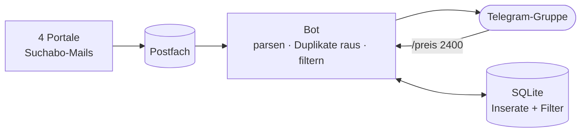

# Wohnungs-Bot Zürich

[](https://github.com/claudiokoller/wohnungs-bot/actions/workflows/ci.yml)
[](LICENSE)

Ein Telegram-Bot, der Mietinserate aus vier Schweizer Immobilienportalen in
einen gemeinsamen Chat bündelt: filtert nach eigenen Kriterien, entfernt
Duplikate über Portalgrenzen hinweg und legt zu jedem Treffer einen fertigen
Bewerbungsentwurf dazu.

Gebaut für eine 2er-WG-Suche in der Region Zürich und dort von Mai bis
September 2026 durchgehend auf einem eigenen Server gelaufen. Danach
pausiert: Wohnung gefunden.

> Python · SQLite · IMAP · Telegram Bot API · GitHub Actions
> · keine Frameworks · ~4'800 Zeilen · 60 Unit-Tests

<!-- Screenshot: Datei als docs/bilder/telegram-feed.png ablegen und die
     folgende Zeile einkommentieren. Vorher Gruppennamen, Mitgliederliste und
     eigene Nachrichten wegschneiden.


-->

## Das Problem

Wer in Zürich sucht, hat Suchabos bei vier Portalen — und damit vier
Mailfluten, in denen dieselben Inserate mehrfach auftauchen und die
interessanten untergehen. Zu zweit suchen heisst zusätzlich: beide brauchen
denselben Stand.

Der Bot macht daraus einen Kanal, ohne Duplikate, mit Filtern, die sich per
Chat-Befehl ändern lassen.

## Architektur



Die Portale schicken ihre Suchabo-Mails an ein eigenes Postfach. Der Bot holt
sie per IMAP ab, liest Preis, Zimmer, Fläche und Ort aus dem HTML, wirft
bereits gesehene Inserate weg, prüft den Rest gegen die Filter und schickt
die Treffer in die Gruppe. Die Filter liegen in SQLite und sind jederzeit per
Chat-Befehl änderbar.

Mehr Details — Ablauf eines Durchlaufs, Datenmodell, Selbstüberwachung:
[docs/architektur.md](docs/architektur.md)

## Warum so gebaut

- **Suchabo-Mails statt Scraping.** Die Portale sind hinter Cloudflare und
  verbieten Scraping. Ihre eigenen Mails liefern dieselben Treffer freiwillig.
- **Dedup über Portalgrenzen.** Dasselbe Inserat kommt oft dreifach. Der Bot
  löst die Tracking-Links auf, um an die echte Listing-ID zu kommen, und
  nutzt sonst einen Fingerprint aus Adresse, Preis, Zimmern und Fläche.
- **Die Datenbank führt, nicht die Config.** `/preis 2400` gilt sofort und
  überlebt Neustart und Deployment. Sonst driften zwei Filterstände auseinander.
- **Bewerbungsentwurf ohne LLM.** Ein festes Template ist für einen Text, der
  an einen Vermieter geht, verlässlicher. Abgeschickt wird nichts automatisch.

## Telegram-Befehle

| Bereich | Befehle |
|---|---|
| Filter | `/preis` · `/zimmer` · `/plz` (auch mit Gemeindenamen) · `/exclude` · `/pause` · `/resume` |
| Inserate | `/liste` · `/delete` · `/now` |
| Status | `/status` · `/stats` · `/portale` · `/help` |
| Betrieb | `/health` (Zustand pro Portal) · `/backup` |

Jedes Inserat kommt mit zwei Buttons: ⭐ Merken und 📝 Entwurf. Um 20:00 fasst
der Bot die gemerkten Inserate des Tages zusammen.

## Betrieb: was schiefging

Der lehrreichste Teil waren die vier Monate nach dem Bauen. Drei Ausfälle,
jeder still — der Bot lief fehlerfrei weiter und schickte einfach nichts mehr:

| Ausfall | Ursache | Konsequenz im Code |
|---|---|---|
| Feed 9 Tage leer | Postfach-Quota voll, Provider wies Mails ab | Verarbeitete Mails werden gelöscht, nicht nur als gelesen markiert |
| Feed 2 Wochen leer | Mailkonto gesperrt, IMAP-Login abgelehnt | Wiederholte Fehler eskalieren statt endlos als "transient" zu gelten |
| Feed leer trotz Mails | Suchabos breiter als der Bot-Filter | Verwerfungsgrund pro Inserat im Log |

Die Lehre: Ein Bot, der Nachrichten weiterleitet, meldet seinen eigenen
Ausfall nicht — Stille sieht aus wie "nichts Passendes dabei". Deshalb
überwacht er heute den Maileingang pro Portal und meldet sich selbst, wenn
eine Quelle verstummt.

## Setup

```bash
git clone https://github.com/claudiokoller/wohnungs-bot.git
cd wohnungs-bot
pip install -r requirements.txt

cp .env.example .env        # Bot-Token, IMAP-Zugang, DB-Pfad
# Suchkriterien und Profil in config.py anpassen

python main.py --seed       # Altinserate als gesehen markieren
python main.py --loop       # Dauerbetrieb, Poll alle 15 Minuten
python command.py           # Telegram-Befehle (zweiter Prozess)
python test_command.py      # 60 Tests, ohne pytest lauffähig
```

Vollständige Anleitung mit Postfach, Suchabos und systemd: [SETUP.md](SETUP.md).

## Module

| Datei | Aufgabe |
|---|---|
| `main.py` | Orchestrierung: `--seed`, `--loop`, `--dump-emails` |
| `email_source.py` | IMAP-Quelle: Alert-Mails → `Listing` |
| `sources.py` | `Listing`-Datentyp + Telegram-Formatierung |
| `db.py` | SQLite: Dedup, Filter, Merkliste, Mail-Log |
| `command.py` | Telegram-Befehle, Tagesübersicht |
| `notify.py` | Versand mit Inline-Buttons |
| `application.py` | Bewerbungsvorlage |
| `plz_lookup.py` | PLZ ↔ Gemeindename, 162 Gemeinden Kanton Zürich |
| `imap_auth.py` | Login providerneutral (Passwort oder OAuth2) |

## Lizenz

MIT — siehe [LICENSE](LICENSE). Profil und Suchkriterien in `config.py` sind
Platzhalter; echte Zugangsdaten gehören in `.env` und nie ins Repo.
