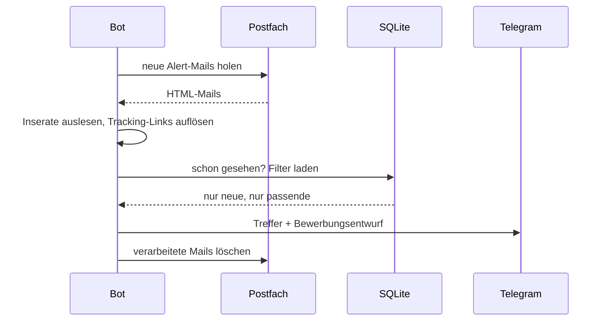

# Architektur

Ergänzung zum [README](../README.md): Ablauf, Datenmodell und die
Überlegungen dahinter.

## Ein Durchlauf

Alle 15 Minuten dieselbe Kette. Jede Quelle ist austauschbar: eine Funktion
`(search, cfg) -> list[Listing]`.

Der letzte Schritt ist wichtiger, als er aussieht: Werden Mails nur als
gelesen markiert, wächst das Postfach unbegrenzt. Läuft es in die Quota,
weist der Provider eingehende Mails ab — der Bot bleibt gesund und bekommt
trotzdem nichts mehr.

## Zwei Prozesse

Auf dem Server laufen zwei systemd-Services: `main.py --loop` für die
Pipeline und `command.py` für das Telegram-Long-Polling. Getrennt, weil sie
unterschiedlich ticken — die Pipeline schläft zwischen den Durchläufen, das
Long-Polling hängt dauerhaft an der API. Stirbt einer, läuft der andere
weiter. Gemeinsamer Zustand liegt nur in SQLite, kein Shared Memory, keine
Queue.

Deployment über GitHub Actions: Tests, dann SCP auf den Server, dann Services
neu starten.

## Datenmodell

| Tabelle | Inhalt |
|---|---|
| `seen` | IDs und Fingerprints bereits gesendeter Inserate |
| `listings` | Daten der gesendeten Treffer, Merk-Flag, Zeitstempel |
| `filter_state` | Die per Chat änderbaren Kriterien (eine Zeile) |
| `mail_log` | Welches Portal wann wie viele Mails geliefert hat |
| `meta` | Letzter Poll, letzte Aktivität, Start der Überwachung |

`filter_state` ist bewusst eine Zeile in der Datenbank statt einer
Config-Datei: Ändert jemand per `/preis 2400` das Budget, gilt das sofort,
überlebt Neustart und Deployment und ist für beide Prozesse dieselbe Wahrheit.

`mail_log` existiert nur wegen der Ausfälle. Ohne ihn lässt sich nicht
unterscheiden, ob ein Portal nichts Passendes schickt oder ob das Suchabo
tot ist.

## Dedup

Dasselbe Inserat erreicht den Bot oft dreifach. Zwei Stufen:

1. **Listing-ID des Portals.** Die Links in den Mails sind
   Tracking-Redirects; der Bot löst sie parallel auf und gewinnt daraus die
   echte ID. Stabilster Schlüssel.
2. **Fingerprint.** Scheitert Schritt 1, wird aus Adresse, Preis, Zimmerzahl
   und Fläche ein Hash gebildet. Fängt dasselbe Inserat auch dann, wenn zwei
   Portale unterschiedliche IDs vergeben.

## Filter-Prinzip

Fehlt ein Feld oder lässt es sich nicht lesen, wird das Inserat
**durchgelassen** — lieber einer zu viel als eine verpasste Wohnung.

Eine Ausnahme: Die Postleitzahl wird hart durchgesetzt. Ist eine PLZ-Liste
gesetzt und keine passende PLZ erkennbar, fliegt das Inserat raus. Ohne diese
Härte ertrinkt der Feed in Inseraten aus der halben Schweiz.

## Selbstüberwachung

Stille ist bei einem weiterleitenden Bot kein Beweis dafür, dass alles gut
ist. Drei Wächter:

- **Maileingang.** Kommt von *keinem* Portal mehr eine Mail, meldet sich der
  Bot — unabhängig davon, ob Inserate durch den Filter kamen.
- **Pro Quelle.** Liefern drei Portale und eines schweigt seit Tagen, ist
  vermutlich genau dieses Suchabo tot.
- **Fehler-Streaks.** Wiederholte Login-Fehler werden eskaliert statt endlos
  als vorübergehend behandelt. Anlass: Ein Provider antwortete auf jeden
  fehlgeschlagenen Login mit demselben generischen `Temporary authentication
  failure` — auch auf ein dauerhaft gesperrtes Konto.

## Bewusst nicht gebaut

- **Kein Scraping der Portalseiten.** Cloudflare davor, AGB dagegen, und die
  Suchabo-Mails liefern dieselben Daten freiwillig.
- **Kein LLM pro Inserat.** Ein festes Template ist verlässlicher und kostet
  nichts.
- **Kein automatischer Versand.** Die Empfängeradresse steht fast nie im
  Inserat; der Kontakt läuft über das Formular des Portals.
- **Kein Framework.** Standard-Library plus `requests` und `beautifulsoup4`.
