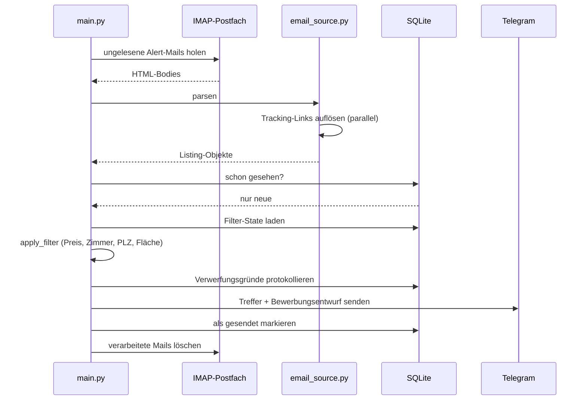
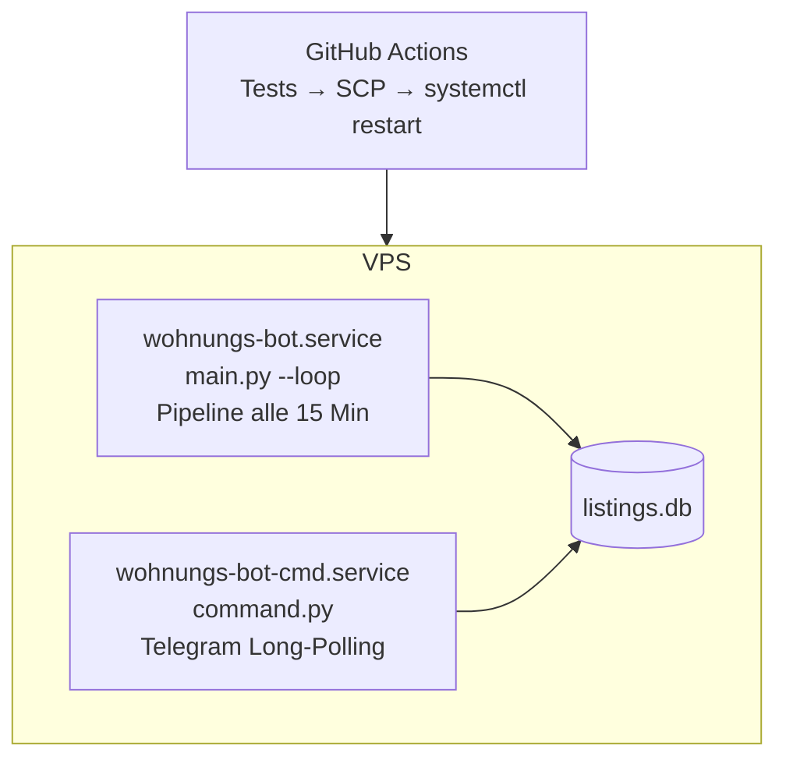

# Architektur

Ergänzung zum [README](../README.md): Datenflüsse, Datenmodell und die
Überlegungen dahinter.

## Ein Durchlauf, Schritt für Schritt

Alle 15 Minuten läuft dieselbe Pipeline. `main.py` orchestriert, jede Quelle
ist austauschbar: eine Funktion `(search, cfg) -> list[Listing]`.

Der letzte Schritt ist wichtiger, als er aussieht: Werden Mails nur als
gelesen markiert, wächst das Postfach unbegrenzt. Läuft es in die Quota des
Providers, weist dieser eingehende Mails ab — der Bot bleibt gesund und
bekommt trotzdem nichts mehr.

## Zwei Prozesse

Getrennt, weil sie unterschiedlich ticken: Die Pipeline schläft die meiste
Zeit, das Long-Polling hängt dauerhaft an der Telegram-API. Stirbt einer der
beiden, läuft der andere weiter; systemd startet ihn neu. Gemeinsamer Zustand
liegt ausschliesslich in SQLite — kein Shared Memory, keine Queue.

## Datenmodell

| Tabelle | Inhalt |
|---|---|
| `seen` | Listing-IDs und Inhalts-Fingerprints, die schon gesendet wurden |
| `listings` | Inseratsdaten der gesendeten Treffer, Merk-Flag, Zeitstempel |
| `filter_state` | Die zur Laufzeit änderbaren Kriterien (eine Zeile) |
| `mail_log` | Welches Portal wann wie viele Mails geliefert hat |
| `meta` | Letzter Poll, letzte Aktivität, Referenzzeitpunkt der Überwachung |

`filter_state` ist bewusst eine einzelne Zeile statt einer Config-Datei:
Ändert jemand per `/preis 2400` das Budget, gilt das sofort für die nächste
Runde, überlebt Neustart und Deployment und ist für beide Prozesse dieselbe
Wahrheit.

`mail_log` existiert nur wegen der Ausfälle. Ohne ihn lässt sich nicht
unterscheiden, ob ein Portal nichts Passendes schickt oder ob das Suchabo
tot ist.

## Dedup

Dasselbe Inserat erreicht den Bot oft dreifach. Zwei Stufen:

1. **Listing-ID des Portals.** Die Links in den Mails sind
   Tracking-Redirects; der Bot löst sie auf (parallel, mit Timeout) und
   gewinnt daraus die echte ID. Stabilster Schlüssel.
2. **Inhalts-Fingerprint.** Scheitert Schritt 1, wird aus Adresse, Preis,
   Zimmerzahl und Fläche ein Hash gebildet. Fängt auch dasselbe Inserat auf
   verschiedenen Portalen mit unterschiedlichen IDs.

## Filter-Prinzip

Bei fehlenden oder unparsbaren Feldern wird ein Inserat **durchgelassen** —
lieber ein Treffer zu viel als eine verpasste Wohnung.

Eine Ausnahme: Die Postleitzahl wird hart durchgesetzt. Ist eine PLZ-Liste
gesetzt und lässt sich im Inserat keine passende PLZ erkennen, fliegt es
raus. Die PLZ ist das wichtigste Kriterium, der Parser liest sie zuverlässig,
und ohne diese Härte ertrinkt der Feed in Inseraten aus der halben Schweiz.

## Selbstüberwachung

Ein weiterleitender Bot kann nicht davon ausgehen, dass Stille normal ist.
Drei Wächter:

- **Maileingang.** Kommt über längere Zeit von *keinem* Portal eine Mail,
  meldet sich der Bot — unabhängig davon, ob Inserate durch den Filter kamen.
- **Pro Quelle.** Liefern drei Portale und eines schweigt seit Tagen, ist
  vermutlich genau dieses Suchabo tot.
- **Fehler-Streaks.** Wiederholte Login-Fehler werden nach einer Weile
  eskaliert statt endlos als vorübergehend behandelt. Anlass: Ein Provider
  antwortete auf jeden fehlgeschlagenen Login mit demselben generischen
  `Temporary authentication failure` — auch auf ein dauerhaft gesperrtes
  Konto.

## Bewusst nicht gebaut

- **Kein Scraping der Portalseiten.** Cloudflare davor, AGB dagegen, und die
  Suchabo-Mails liefern dieselben Daten freiwillig.
- **Kein LLM pro Inserat.** Ein deterministisches Template ist für einen
  Text, der an einen Vermieter geht, verlässlicher und kostet nichts.
- **Kein automatischer Versand.** Die Empfängeradresse steht fast nie im
  Inserat; der Kontakt läuft über das Formular des Portals.
- **Kein Framework.** Standard-Library plus `requests` und `beautifulsoup4`.
  Bei dieser Grösse ist jede weitere Abhängigkeit mehr Wartung als Gewinn.
